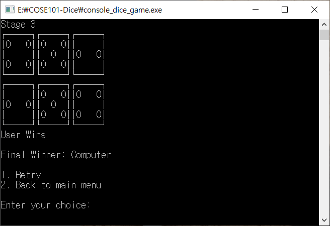

# 콘솔 주사위 던지기 게임

![Language][language-c]
[![School Project][korea-university-image]][korea-university-cs-url]
![Course][course-cose101]
![Grade][grade-a+]

> 콘솔에서 주사위를 굴려서 컴퓨터를 이기면 점수를 얻고, 지면 점수를 잃는 게임입니다.

## 스크린샷

## 라이선스 및 공동체 수정

개인 프로젝트 백업용 저장소입니다.

  * 모든 제3자 사용을 허가하지 않습니다.
  * 모든 제3자 수정을 승인하지 않습니다.
    * 깃허브 Pull Request를 받지 않습니다.

<!-- Image definitions -->
[korea-university-image]: https://img.shields.io/badge/Institution-Korea%20University-red
[korea-university-cs-url]: http://cs.korea.ac.kr
[course-cose101]: https://img.shields.io/badge/Course-Computer%20Programming%20I-brightgreen
[language-c]: https://img.shields.io/badge/Language-C-orange
[grade-a+]: https://img.shields.io/badge/Grade-A%2B-yellow
